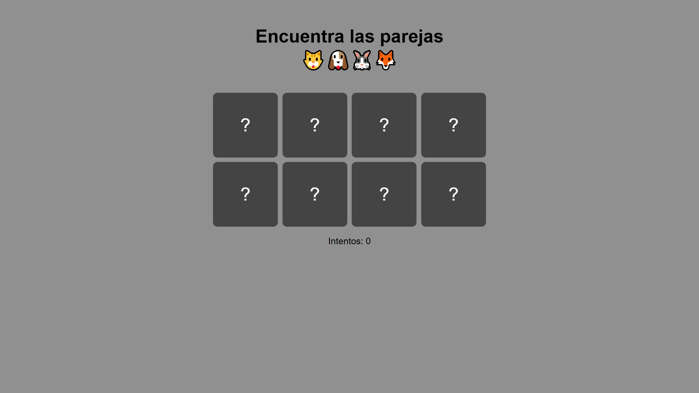

# 🧠 Juego de Memoria con Cartas de Animales 🐱🐶🐰🦊

Un juego de memoria simple y visual hecho con HTML, CSS y JavaScript.  
El objetivo es emparejar todas las cartas con los menos intentos posibles
(o a la primera si tienes suerte).

## 🕹️ Cómo jugar

- Haz clic en las cartas para voltearlas.
- Encuentra las parejas iguales.
- Cuando aciertes todas, podrás reiniciar el juego.

## 📱 Responsive

- Diseño adaptado para móviles, tablets e iPad.
- Distribución simétrica de cartas:  
  - 4x2 en pantallas grandes  
  - 2x4 en móviles

## 🎨 Estilo y características

- Estética minimalista y centrada.
- Animación de volteo de cartas.
- Sonido al destapar cartas (requiere interacción previa por navegador).
- Icono personalizado (`favicon.ico`) con emojis animales.

